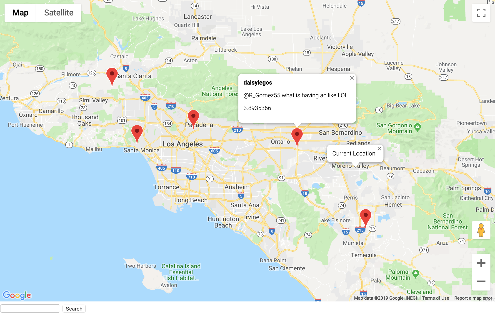

# CS172:  Information Retrieval Final Project
This project utilizes the Twitter Streaming API to collect and map geolocated tweets within 100 miles from user location.

### Team: 🐦 C://Untitled 🐦
          Katherine Legaspi
          Kevin Frazier
          Nate Mueller

## How to run:

Set up for Part 3 - Extension: Follow the README setup in the elastic folder. When running the curl command, add '>> q.json'.
This will create a json file with an output of the relevant query. 

The user can simply change the word in the command line with any word he/she wants to see in "text:" field, as well as the radius of the tweet
from the user location.

TweetToMap.js will read in the 'q.json' file and add marker/s to the relevant tweet/s with relevant information. "

## What's included:

      sampleTweets.json - 1GB of twitter data
      index.html & tweetToMap.js -  UI framework

 ## Part 1 - Crawler
 1. Collaborate Details: 

   Kevin Frazier: Implemented twitter stream..etc

   Katherine Legaspi: Set up Twitter API keys, basic myStreamListener, and getTitle() function that takes in a url and returns the title of the website

 2. Overview of system

    (a) Architecture

    (b) The Crawling or data collection strategy

    (c) Data Structures employed

 3. Limitations 

      Limitations includes

 4. How to deploy the crawler

 5. Screenshots

 ## Part 2 - Indexer
 1. Collaborate Details: Nate Mueller 

 2. Overview of system 

    (a) Architecture
 
    (b) Index Structure
 
    (c) Search Algorithm
 
 3. Limitations 
 
 4. How to deploy the system

      Refer to README in elastic folder 

 ## Part 3 - Extension
 1. Collaborate Details: Katherine Legaspi 

 We chose the Twitter geolocation extension that allows for search and display results on a map. The extension takes in user location, if browser allows, and center maps to the current location. Each tweet relevant to the query entered by the user will be marked with a red point. When the marker is clicked, a bubble should display the username, tweet text, and the score.

 A limitation I encountered is that if multiple tweets have the same geolocation (same longitude and latitude), only one tweet is displayed. We chose to implement the Twitter geolocation because it would a good visualization of twitter data. 

Tools: Google Maps API

This map image example runs the query word: "like" in a 1000km radius from user location

