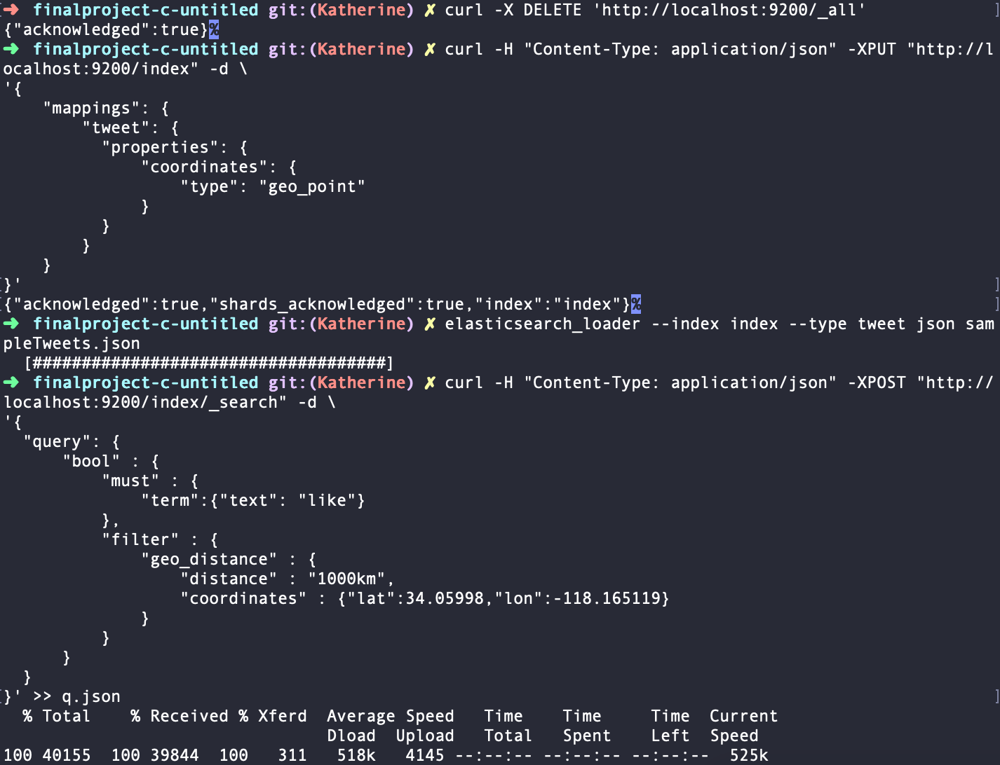

# CS172:  Information Retrieval Final Project
This project utilizes the Twitter Streaming API to collect and map geolocated tweets within 100 miles from user location.

### Team: 🐦 C://Untitled 🐦
          Katherine Legaspi
          Kevin Frazier
          Nate Mueller

## How to run:

Set up for Part 3 - Extension: Follow the README setup in the elastic folder. When running the curl command, add '>> q.json'.
This will create a json file with an output of the relevant query. 

The user can simply change the word in the command line with any word he/she wants to see in "text:" field, as well as the radius of the tweet
from the user location.

TweetToMap.js will read in the 'q.json' file and add marker/s to the relevant tweet/s with relevant information. "

## What's included:

      sampleTweets.json - 1GB of twitter data
      index.html & tweetToMap.js -  UI framework

 ## Part 1 - Crawler
 1. Collaborate Details: 

   Kevin Frazier: Implemented twitter stream, getURLTitles()

   Katherine Legaspi: Set up Twitter API keys, basic myStreamListener
   
 2. Overview of system

    (a) Architecture
          The architecture of the project is pretty straight forward. We first get the filter for our twitter stream using the "geocoder" library. This looks at the IP.address of the user and grabs the coordinates at the address.
         
         g = geocoder.ip('me')
         currentLocation = g.latlng
         LOCATIONS = [currentLocation[1]-1.5,currentLocation[0]-1.5,currentLocation[1]+1.5,currentLocation[0]+1.5]
         
    In order to use the api, we must initialize the twitter api with the given consumer and access keys. Then, we can initialize the twitter streamer with the given filters based off of location.
    
          stream_listener = StreamListener(api=tweepy.API(wait_on_rate_limit=True))
          stream = tweepy.Stream(auth=auth, listener=stream_listener)
          stream.filter(locations=LOCATIONS)
In this SteamListener class, we have function ondata() that will call everytime a tweet is received in JSON format. These tweets are then processed by adding fields to format for Elastic Search. Below is a screen shot of the filtered tweets being received.         
         

    (b) The Crawling or data collection strategy
    
The crawling of the data happens whenever we receive a tweet. The function getUrlTitles() will look "text" field of the tweet, use regex to find any urls, then uses a combination of urllib2 and BeautifulSoup access the html of the link and parse the title. Below is the code for the function.

          def GetUrlTitles(string):
	          urls = getUrl(string);
	          urlTitles = []
	          if urls:
		          for url in urls:
			          soup = BeautifulSoup(urllib2.urlopen(url))
			          urlTitles.append(soup.title.string)
	          return urlTitles

    (c) Data Structures employed
    
At first, a pandas dataframe was used to check for duplicates, and process all the tweets after they were collected (such as reformatting for ElasticSearch, crawling, etc). Although, this was eventually moved to the stream process.

 3. Limitations 

      Limitations includes
      -slow one-processor stream with delays from Crawler
      
      

 4. How to deploy the crawler
 Run the twitter stream. The crawler runs concurrently with the twitter stream.

 5. Screenshots

 ## Part 2 - Indexer
 1. Collaborate Details: Nate Mueller 

 2. Overview of system 

    (a) Architecture
 
    (b) Index Structure
 
    (c) Search Algorithm
 
 3. Limitations 
 
 4. How to deploy the system

      Refer to README in elastic folder 

 ## Part 3 - Extension
 1. Collaborate Details: Katherine Legaspi 

 We chose the Twitter geolocation extension that allows for search and display results on a map. The extension takes in user location, if browser allows, and center maps to the current location. Each tweet relevant to the query entered by the user will be marked with a red point. When the marker is clicked, a bubble should display the username, tweet text, and the score.

 A limitation I encountered is that if multiple tweets have the same geolocation (same longitude and latitude), only one tweet is displayed. We chose to implement the Twitter geolocation because it would a good visualization of twitter data. 

Tools: Google Maps API

This map image example runs the query word: "like" in a 1000km radius from user location

