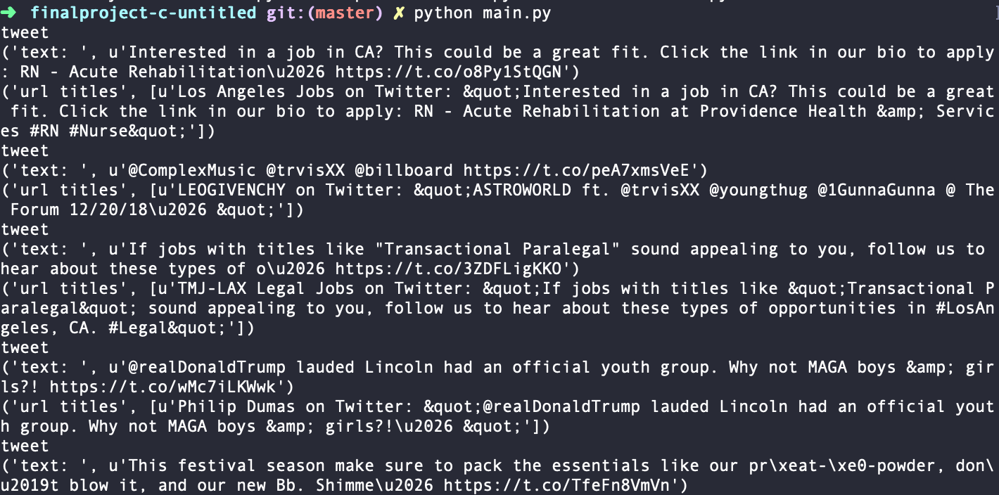
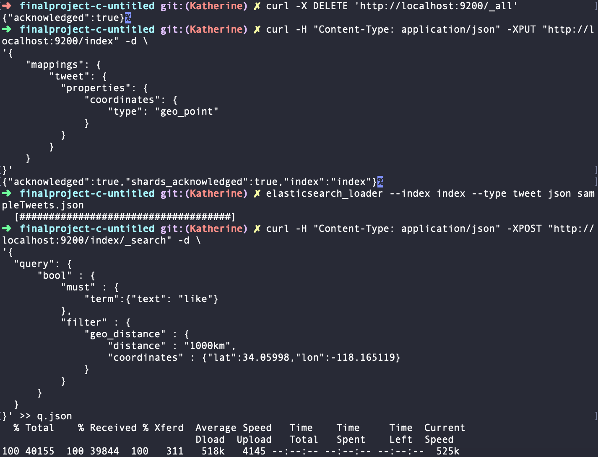
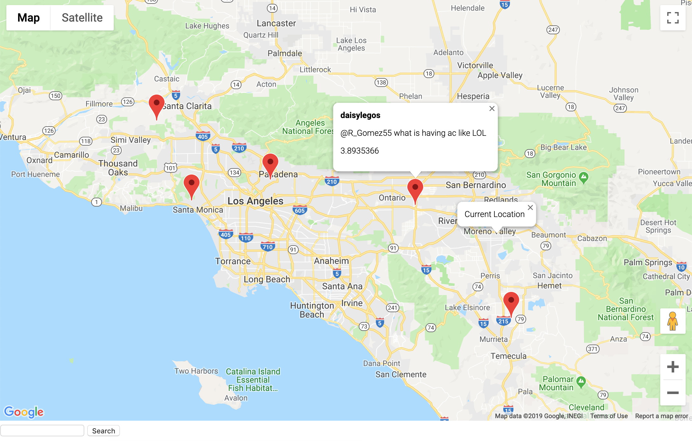

# CS172:  Information Retrieval Final Project
This project utilizes the Twitter Streaming API to collect and map geolocated tweets within 100 miles from user location.

### Team: 🐦 C://Untitled 🐦 
          Katherine Legaspi
          Kevin Frazier
          Nate Mueller

## How to run:

Set up for Part 1 - Twitter Stream: In order to run the stream you need to run the following command:
	python main.py

After the stream is done or the stream is kicked, a sampleTweets.json will be outputted with the tweets.

Set up for Part 3 - Extension: Follow the README setup in the elastic folder. When running the curl command, add '>> q.json'.
This will create a json file with an output of the relevant query. 

The user can simply change the word in the command line with any word he/she wants to see in "text:" field, as well as the radius of the tweet
from the user location.

TweetToMap.js will read in the 'q.json' file and add marker/s to the relevant tweet/s with relevant information. "

## What's included:

      sampleTweets.json - 1GB of twitter data (We pushed a sample of the tweets <20 MB)
      index.html & tweetToMap.js -  UI framework

 ## Part 1 - Crawler
 1. Collaborate Details: 

   Kevin Frazier: Implemented twitter stream, getURLTitles()

   Katherine Legaspi: Set up Twitter API keys, basic myStreamListener
   
 2. Overview of system

    (a) Architecture
          The architecture of the project is pretty straight forward. We first get the filter for our twitter stream using the "geocoder" library. This looks at the IP.address of the user and grabs the coordinates at the address.
         
         g = geocoder.ip('me')
         currentLocation = g.latlng
         LOCATIONS = [currentLocation[1]-1.5,currentLocation[0]-1.5,currentLocation[1]+1.5,currentLocation[0]+1.5]
         
    In order to use the api, we must initialize the twitter api with the given consumer and access keys. Then, we can initialize the twitter streamer with the given filters based off of location.
    
          stream_listener = StreamListener(api=tweepy.API(wait_on_rate_limit=True))
          stream = tweepy.Stream(auth=auth, listener=stream_listener)
          stream.filter(locations=LOCATIONS)
In this SteamListener class, we have function ondata() that will call everytime a tweet is received in JSON format. These tweets are then processed by adding fields to format for Elastic Search. Below is a screen shot of the filtered tweets being received.         
         

    (b) The Crawling or data collection strategy
    
The crawling of the data happens whenever we receive a tweet. The function getUrlTitles() will look "text" field of the tweet, use regex to find any urls, then uses a combination of urllib2 and BeautifulSoup access the html of the link and parse the title. Below is the code for the function.

          def GetUrlTitles(string):
	          urls = getUrl(string);
	          urlTitles = []
	          if urls:
		          for url in urls:
			          soup = BeautifulSoup(urllib2.urlopen(url))
			          urlTitles.append(soup.title.string)
	          return urlTitles

    (c) Data Structures employed
    
At first, a pandas dataframe was used to check for duplicates, and process all the tweets after they were collected (such as reformatting for ElasticSearch, crawling, etc). Although, this was eventually moved to the stream process.

 3. Limitations 

      Limitations includes
      -slow one-processor stream with delays from Crawler
      
      

 4. How to deploy the crawler
 Run the twitter stream. The crawler runs concurrently with the twitter stream.

 5. Screenshots
 
 
 
 Here is the stream. Some print statements suggests the extraction of the title from their url that is embedded from the text.

 ## Part 2 - Indexer
 1. Collaborate Details: Nate Mueller 

 2. Overview of system 

    (a) Architecture
    The indexer is the lucene implimentation thats built into elastic search. Originally I began using the stand alone lucene implimentation but when i realized that elastic search (which is what we were already planning to use) had lucene built in I ditched that code and went for just elastic search on its own. The lucene indexing code I wrote is in the lucene folder. It builds an index successfully but the querying mechanism is not built in.
    A mapping is used to identify the coordinates of the tweet's locations as reported in the tweet. The elasticsearch-loader python library loads the json into elastic search. After that a query can be made to localhost:9200/[indexname] with the geo_distance filter if you want to filter by location.
 
    (b) Index Structure
    The index is structured as an array, where each item in the array is a tweet in JSON format, only including the fields we need, which is text, username, date, location, any links etc. The mapping simply takes the coordinates array in the tweet and saves it as the geo_point object for location filtering.
 
    (c) Search Algorithm
    Elastic search has a built in search system that assigns every doc an ID and then matches terms that are in the doc with those that are in the query. Since our tweets have multiple fields we specify to search for the term in the text field of the tweet. TF-IDF ranks the results on how relevant they are and returns the tweets ordered by score.
 
 3. Limitations 
 
 The indexing is somewhat limited in that you need to run the mapping before the indexing and also you have to clear it and reindex if you want to change any piece of it or else there will be repeats.
 
 4. How to deploy the system

      Refer to README in elastic folder.

 ## Part 3 - Extension
 1. Collaborate Details: Katherine Legaspi 

 We chose the Twitter geolocation extension that allows for search and display results on a map. The extension takes in user location, if browser allows, and center maps to the current location. Each tweet relevant to the query entered by the user will be marked with a red point. When the marker is clicked, a bubble should display the username, tweet text, and the score.

 A limitation I encountered is that if multiple tweets have the same geolocation (same longitude and latitude), only one tweet is displayed. We chose to implement the Twitter geolocation because it would a good visualization of twitter data. 

Tools: Google Maps API

This map image example runs the query word: "like" in a 1000km radius from user location

